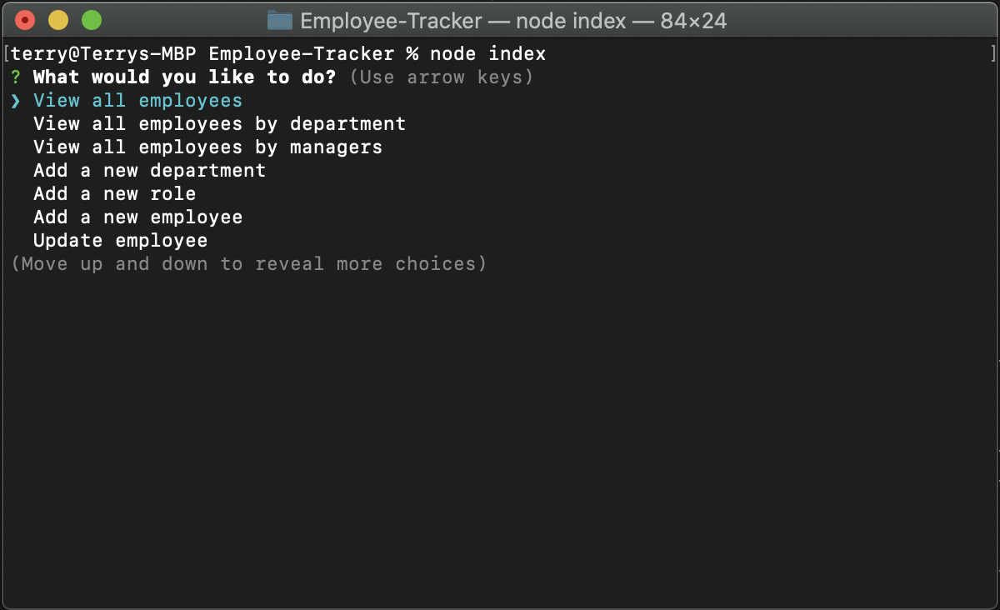

# Employee-Tracker
This application will read, update, and delete from your employee information database. You can view all employee, add new department, add new role, add new employee, and delete employee. You will need to setup your mysql server first. Read more in setup section. 

- [Setup](#setup)
- [Credit](#credit)
- [Link](#link)
- [Demo](#demo)
- [License](#license)

## Setup
Use schema.sql to setup your sql server. Update your connection setting in connection.js. Run "npm i" in terminal to install necessary components. "npm start" or "node index" to run the application. 

## Credit
Node.js

Inquirer

mysql

console.table

## Link
[Employee Tracker](https://github.com/Terry0532/Employee-Tracker)

## Demo
[Youtube Link](https://youtu.be/rNh6FII8vYc)

## License

[MIT License](LICENSE)